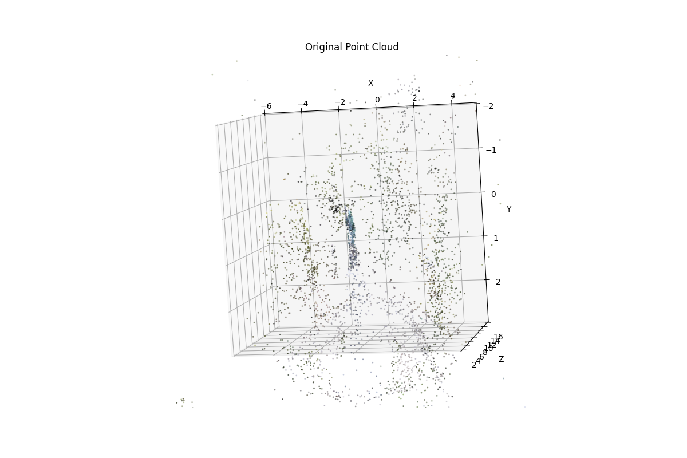
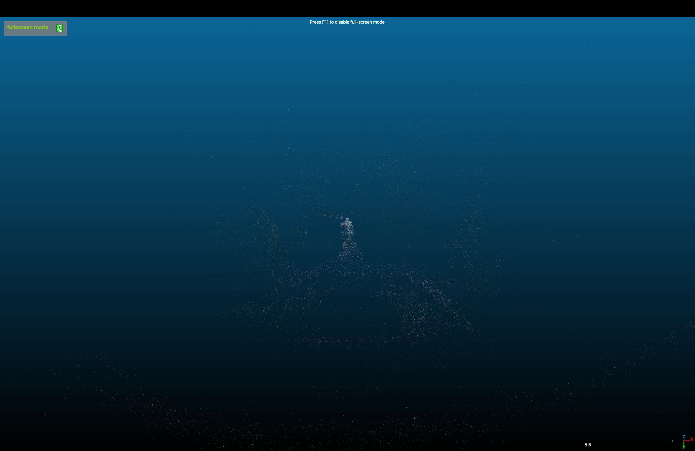
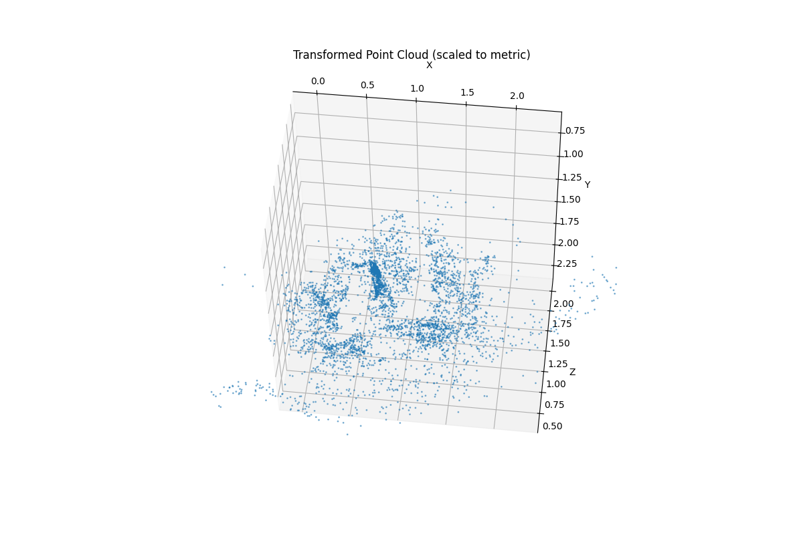
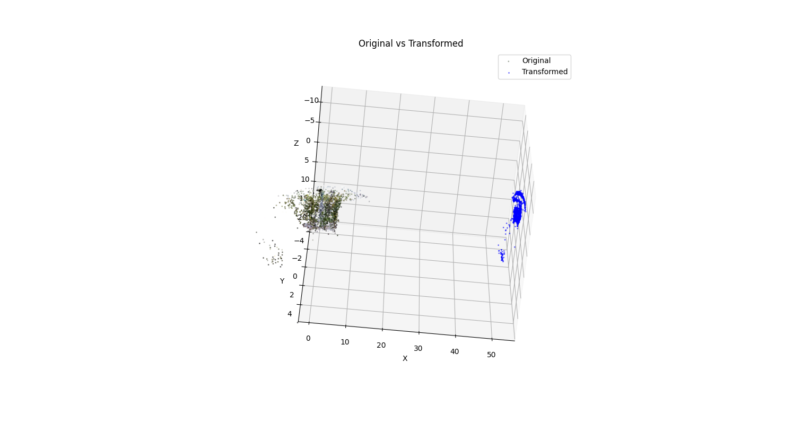

# 3D Point Cloud Reconstruction and Transformation

For the test task I decided to choose a video of something that does not have a ready-made 3D model, I decided to go with this [video](https://www.youtube.com/watch?v=QU2GRAB816s&pp=0gcJCQsKAYcqIYzv) of the drone flying over the statue of Duke Volodymyr of Kyiv. I specifically checked that it does not have a ready made 3D model

## Overview

The pipeline consists of two main stages:
1. **3D Reconstruction**: Extract frames from video and create a sparse 3D point cloud using COLMAP
2. **Transformation**: Apply translation, rotation, and scaling transformations to the point cloud with mathematical validation

## Prerequisites

```bash
# COLMAP (for 3D reconstruction)
brew install colmap  # macOS
# or apt-get install colmap  # Ubuntu

# Python dependencies
pip install numpy matplotlib plyfile
```

## Stage 1: COLMAP 3D Reconstruction

### 1.1 Video to Frames Extraction

Extract 100 frames from the video:

```python
# sample_frames.py
import os
import shutil

source_dir = "volodymyr/raw_images"
output_dir = "volodymyr/images"
os.makedirs(output_dir, exist_ok=True)

frames = sorted(os.listdir(source_dir))
interval = len(frames) // 100

for i, frame in enumerate(frames[::interval][:100]):
    src = os.path.join(source_dir, frame)
    dst = os.path.join(output_dir, f"{i:05d}.jpg")
    shutil.copy(src, dst)

print(f"Sampled {len(os.listdir(output_dir))} frames")
```

### 1.2 COLMAP Reconstruction Pipeline

#### Step 1: Feature Extraction
Extract SIFT features from images:

```bash
colmap feature_extractor \
    --database_path database.db \
    --image_path images \
    --ImageReader.single_camera 1
```

**Parameters:**
- `database_path`: SQLite database for storing features
- `image_path`: Directory containing input images
- `single_camera 1`: Assumes all images from same camera

#### Step 2: Exhaustive Matching
Match features between all image pairs:

```bash
colmap exhaustive_matcher \
    --database_path database.db
```

**Note:** Exhaustive matching compares every image with every other image. For N images, this performs N�(N-1)/2 comparisons.

#### Step 3: Sparse Reconstruction
Build 3D point cloud from matched features:

```bash
mkdir -p sparse

colmap mapper \
    --database_path database.db \
    --image_path images \
    --output_path sparse
```

**Output:** Creates `sparse/0/` directory containing:
- `cameras.bin`: Camera intrinsic parameters
- `images.bin`: Camera poses (rotation + translation)
- `points3D.bin`: 3D point coordinates and colors

#### Step 4: Export to PLY Format

```bash
colmap model_converter \
    --input_path sparse/0 \
    --output_path sparse/0/points.ply \
    --output_type PLY
```


*Original 3D point cloud reconstruction (40,681 points with RGB colors)*

*Original 3D point cloud reconstruction in CloudCompare*

## Stage 2: Point Cloud Transformation

The transformation script (`transform_pointcloud.py`) applies three geometric transformations and validates the results.
To substitute Open3D (which would have been a lot more comfortable for the transforemations) matplotlib, plyfile and mpl_toolkits were used. The reason for that is I accidentally updated my python to 3.13 which is not yet supported by Open3D

### Transformations Applied

#### 2.1 Translation (5 units along camera vector)

**Logic:** Move all points by the same displacement vector.

```python
def translate_along_vector(points, vector, distance):
    unit_vector = vector / np.linalg.norm(vector)
    translation = unit_vector * distance
    points = points + translation
    return points, translation
```

**Formula:** `P' = P + d�v` where v is the unit direction vector, d is distance.

#### 2.2 Rotation (60� clockwise around camera vector)

**Logic:** Rodrigues' rotation formula for arbitrary axis rotation.

```python
def rotate_around_vector(points, center, axis_vector, angle_degrees, clockwise=True):
    angle_rad = np.radians(angle_degrees)
    if clockwise:
        angle_rad = -angle_rad

    k = axis_vector / np.linalg.norm(axis_vector)

    K = np.array([
        [0, -k[2], k[1]],
        [k[2], 0, -k[0]],
        [-k[1], k[0], 0]
    ])

    R = np.eye(3) + np.sin(angle_rad) * K + (1 - np.cos(angle_rad)) * (K @ K)

    points = points - center
    points = (R @ points.T).T
    points = points + center

    return points, R
```

**Formula:** `R = I + sin(�)K + (1-cos(�))K�` (Rodrigues' rotation formula)
- K is the skew-symmetric matrix of the normalized axis vector
- For clockwise rotation: � is negated

#### 2.3 Scaling (20cm � 1m per unit)

**Logic:** Scale factor = target_unit / original_unit = 1m / 0.2m = 0.2

```python
def scale_reconstruction(points, scale_factor):
    center = np.mean(points, axis=0)
    points = points - center
    points = points * scale_factor
    points = points + center * scale_factor
    return points
```

**Effect:** All coordinates multiplied by 0.2. Original scale: 1 unit = 20cm. New scale: 1 unit = 1m.

### Validation

The validation function verifies transformations by:
1. Selecting 5 random points from the original cloud
2. Manually computing expected positions: `scale(rotate(translate(P)))`
3. Comparing with actual transformed coordinates
4. Computing Euclidean distance error

```python
def validate_transformations(original_points, transformed_points,
                            translation, rotation_matrix, scale_factor, rotation_center):
    pt = original_pt + translation

    pt_centered = pt - rotation_center
    pt_rotated = rotation_matrix @ pt_centered
    pt = pt_rotated + rotation_center

    transformed_center = rotation_center + translation
    pt_centered = pt - transformed_center
    pt_scaled = pt_centered * scale_factor
    pt_final = pt_scaled + transformed_center * scale_factor

    error = ||pt_actual - pt_expected||
```


*Transformed point cloud after translation, rotation, and scaling to metric units*


*Side-by-side comparison: Original (colored) vs Transformed (blue)*

## Usage

### Run COLMAP Reconstruction

```bash
# 1. Extract frames
python sample_frames.py

# 2. Run COLMAP pipeline
colmap feature_extractor --database_path database.db --image_path images --ImageReader.single_camera 1
colmap exhaustive_matcher --database_path database.db
colmap mapper --database_path database.db --image_path images --output_path sparse
colmap model_converter --input_path sparse/0 --output_path sparse/0/points.ply --output_type PLY
```

### Run Transformations

```bash
python transform_pointcloud.py
```

**Output:**
- Three visualization windows (original, transformed, comparison)
- Console output with transformation matrices and validation results
- Saved file: `transformed_cloud.ply`

## Results

**Reconstruction:**
- Input: 1500 raw frames from video
- Sampled: 100 frames for reconstruction
- Output: 40,681 3D points with RGB colors


**Transformations:**
- Translation vector: [4.402, 2.201, 0.880] units
- Rotation: 60� clockwise around [1.0, 0.5, 0.2] vector
- Scale factor: 0.2 (5x reduction in coordinate space)

**Validation:**
- Average error: 0.00000000 units
- Maximum error: 0.00000000 units
- Status: PASSED (all errors < 0.001)

## Mathematical Explanations

### Translation
Moving all points by a constant vector preserves the shape and orientation of the object. Only the position changes.

### Rotation (Rodrigues' Formula)
Rotates points around an arbitrary axis passing through a specified center. The rotation matrix R is constructed using:
- Axis-angle representation (axis k, angle �)
- Skew-symmetric cross-product matrix K
- Clockwise rotation: negative angle when viewing along the axis direction

### Scaling
Multiplies all coordinates by a constant factor. Scaling around the center preserves the object's position while changing its size. A scale factor of 0.2 makes the coordinate values 5� smaller, effectively changing the unit of measurement from 20cm to 1m.

### Transformation Order
Order matters: `Transform = Scale(Rotate(Translate(P)))`
- Apply translation first to move the object
- Then rotation around the original center
- Finally scale with adjusted center position

## File Structure

```
volodymyr/
    raw_images/          # Original video frames
    images/              # Sampled frames for reconstruction
    database.db          # COLMAP feature database
    sparse/
        0/
            cameras.bin
            images.bin
            points3D.bin
            points.ply   # Exported point cloud
    sample_frames.py     # Frame extraction script
    transform_pointcloud.py  # Transformation script
    transformed_cloud.ply    # Output
    original_pointcloud.png
    transformed_pointcloud.png
    comparison_pointcloud.png
    README.md
```

